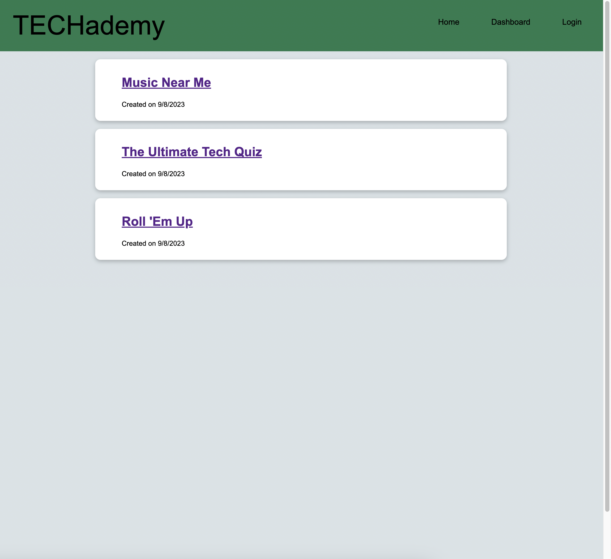
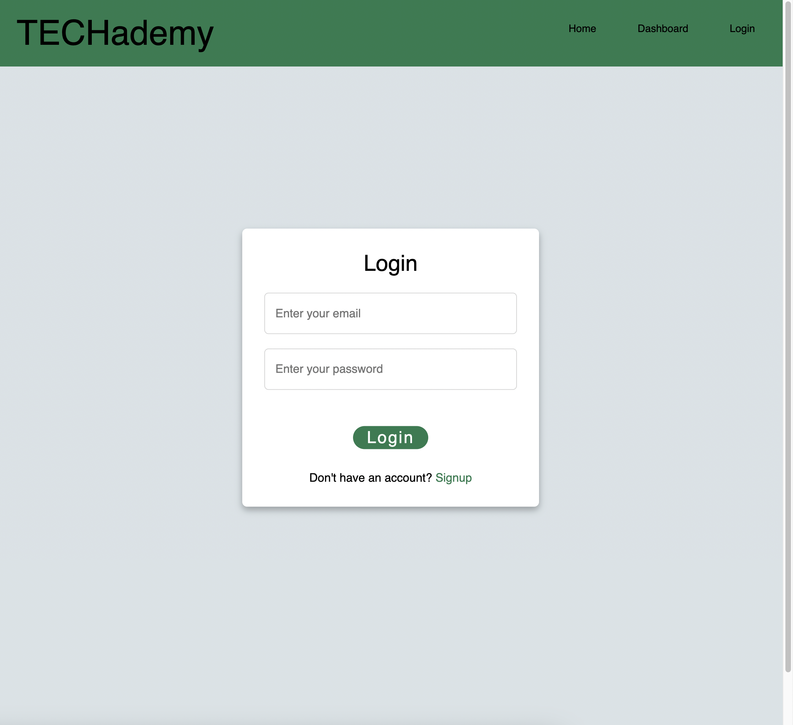
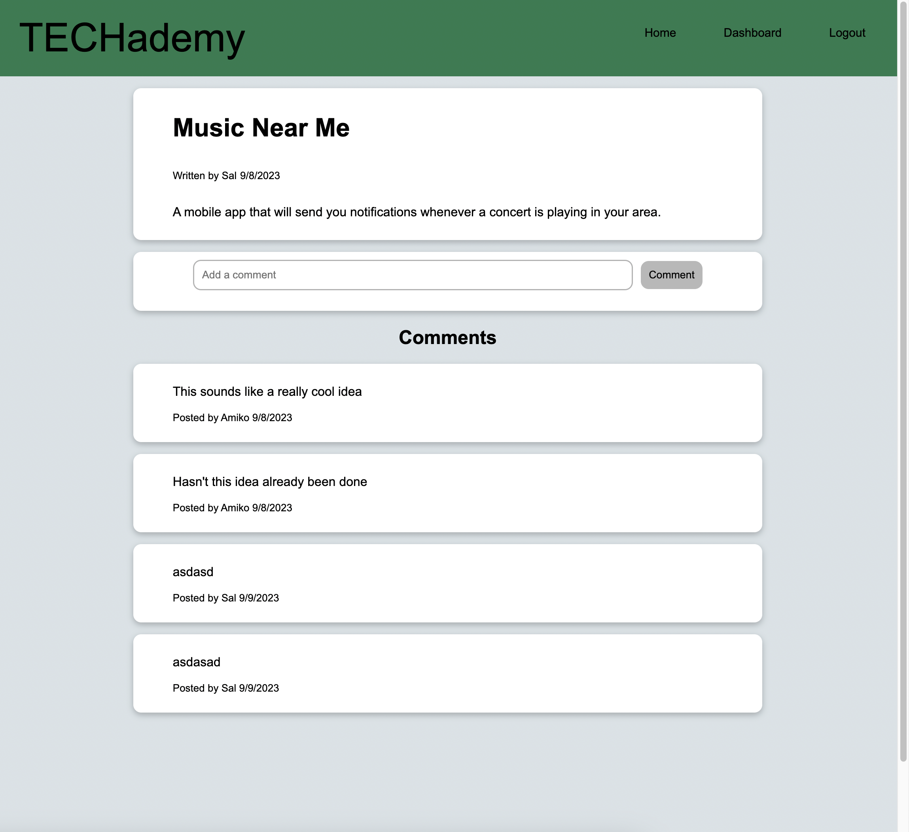
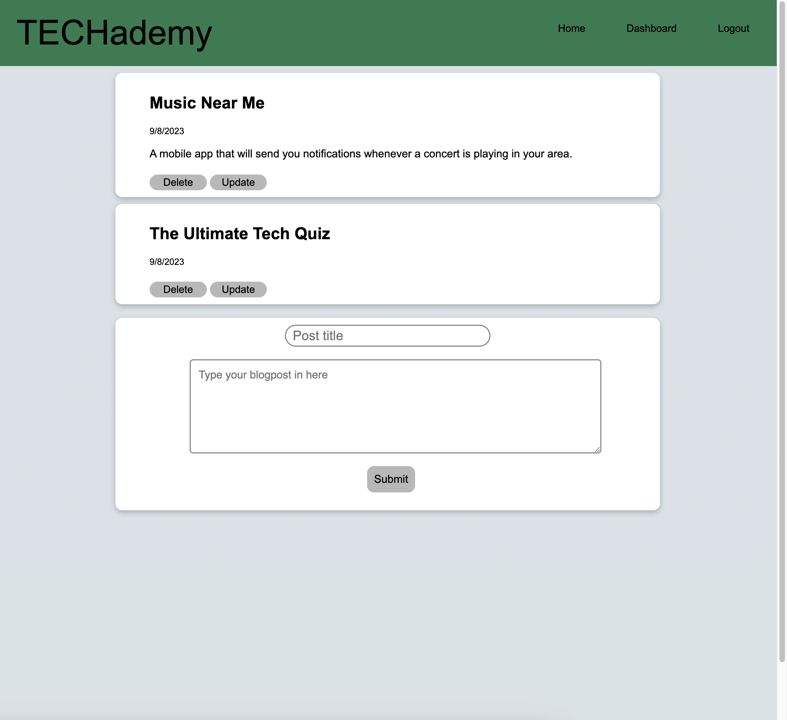

# <TECHademy>

## Description

This is a full stack blogposting project called TEChademy. This site allows users to view other users blogposts and leave comments. If the users is logged in them they can update or delete their own personal blogposts. This project was one of the most challenging to complete, as there were many moving parts and pieces to understand and implement properly. However it proved to be an invaluable learning experience. 

## Resources

These links are some of resources used: 
- https://www.codingnepalweb.com/free-login-registration-form-html-css/
- https://sequelize.org/docs/v6/core-concepts/model-instances/
- https://www.youtube.com/watch?v=mFVqL5aIjSE
- https://www.techiediaries.com/how-to-use-sequelize-findall/

## Installation

Prior to running this project it's best you have MYSQL downloaded and your server active.

Furthermore make sure you source the schema.sql (located in db folder).

It is optional to seed the seeds folder with the command (node seeds/seed.js) in your integrated terminal, however it is not necessary if you don't want this mock data to be active in the project.

Then npm install in the terminal to make sure you have all the necessary dependancies.

Then run node.server.js if you wish to run the program on your own personal server in order to see it live.

## Usage

Link to live page: https://glacial-mountain-10223-54ff428b08c6.herokuapp.com/

## License

MIT License
